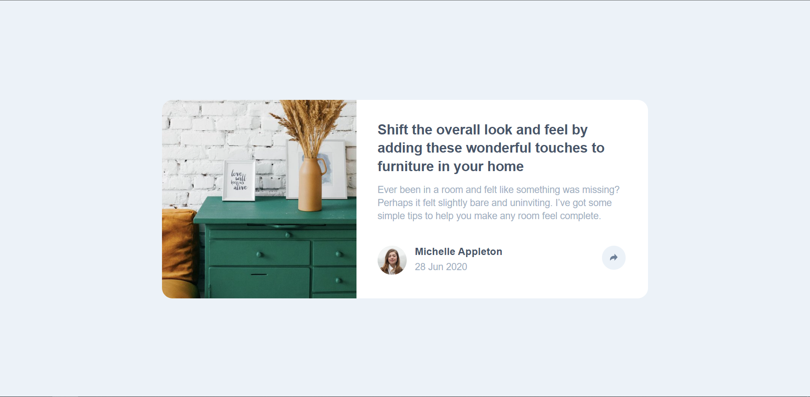

# Frontend Mentor - Article preview component solution

This is a solution to the [Article preview component challenge on Frontend Mentor](https://www.frontendmentor.io/challenges/article-preview-component-dYBN_pYFT). Frontend Mentor challenges help you improve your coding skills by building realistic projects.

## Table of contents

- [Overview](#overview)
  - [The challenge](#the-challenge)
  - [Screenshot](#screenshot)
  - [Links](#links)
- [My process](#my-process)
  - [Built with](#built-with)
  - [What I learned](#what-i-learned)
  - [Continued development](#continued-development)
  - [Useful resources](#useful-resources)
- [Author](#author)

## Overview

### The challenge

Users should be able to:

- View the optimal layout for the component depending on their device's screen size
- See the social media share links when they click the share icon

### Solution Screenshot

### Links

- [Solution](https://www.frontendmentor.io/solutions/responsive-solution-using-flexbox-zPXlpff5LL)
- [Live Site](https://ishmaelsealey.github.io/fem-article-preview-component/)

## My process

### Built with

- Semantic HTML5 markup
- CSS custom properties
- Flexbox
- CSS Grid

### What I learned

I learned that I should adequately plan a strategy for completing my challenge. It will help me predict any issues that I may come across, and it will keep me focused when I am putting it together.

I also learnt that I should try using a mobile first workflow with my website designs to make it easier to cater for responsive design.

### Continued development

I wish to focus on mobile first development as well as alternative ways of styling my pages.
While styling the article, I recognized that some of what I did was not great design, however I did not know any other way of doing it. I believe that I should research more ways of fulfilling the same task in future projects.

### Useful resources

- [W3 Schools](https://www.w3schools.com) - This helped me figure out the different properties I could use in css to position objects where I wanted them.

## Author

- GitHub - [ishmael sealey](https://github.com/Ishmaelsealey/)
- Frontend Mentor - [@ishmaelsealey](https://www.frontendmentor.io/profile/ishmaelsealey)
